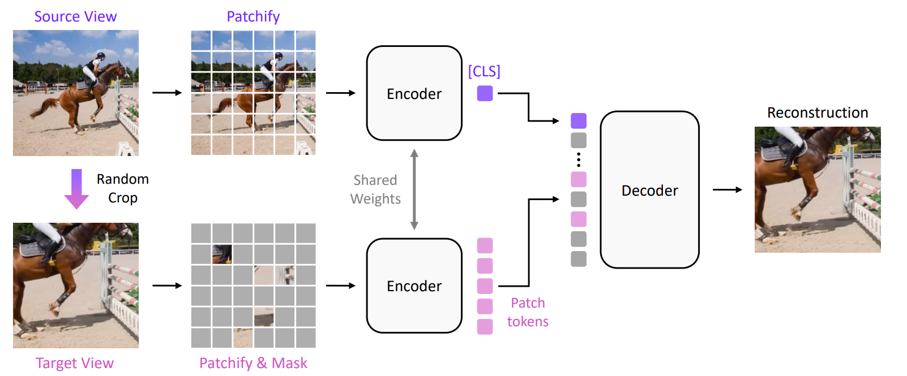
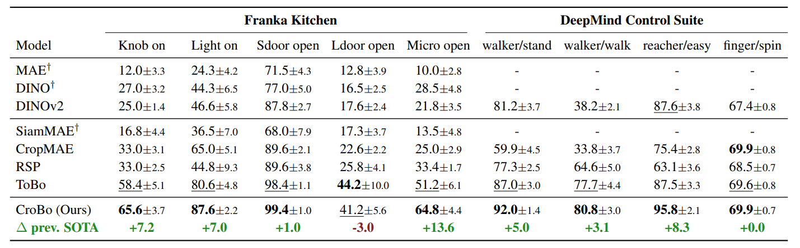
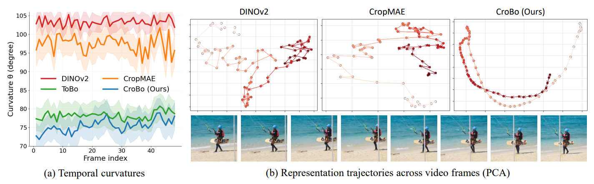

# Pixel-level Scene Understanding in One Token: Visual States Need What-is-Where Composition

**CroBo** is a self-supervised visual representation learning framework for robotic agents. It encodes a scene into a single compact token that jointly captures the semantic identity and spatial location of scene elements (*what-is-where*), enabling effective downstream visuomotor policy learning.

> *Pixel-level Scene Understanding in One Token: Visual States Need What-is-Where Composition*
> [arXiv:2603.13904](https://arxiv.org/abs/2603.13904)

---

## Method

Given a single video frame, CroBo constructs a **global source view** and a **local target view**. The shared-weight encoder compresses the global view into a single bottleneck **[CLS] token**, which is then used alongside sparse visible patches from the masked local view to reconstruct the missing content.

---

## Quantitative Results

---

## Qualitative Results

**Reconstruction**

**Representation Trajectories**

---

## Repository Structure

### 1. `pretraining/`
Contains the code for pre-training the CroBo visual backbone. The model is trained with a global-to-local reconstruction objective on video data, where a single bottleneck token is trained to compress full scene content for reconstructing spatially cropped views.

### 2. `eval-franka/`
Contains the code for evaluating CroBo representations on the **Franka Kitchen** robotic manipulation benchmark. The frozen backbone is paired with a lightweight MLP policy head trained via behavior cloning on expert demonstrations.

### 3. `eval-DMC/`
Contains the code for evaluating CroBo representations on the **DeepMind Control Suite (DMC)** benchmark. Evaluations cover both manipulation and locomotion tasks in a purely vision-based setting (no proprioceptive inputs).
